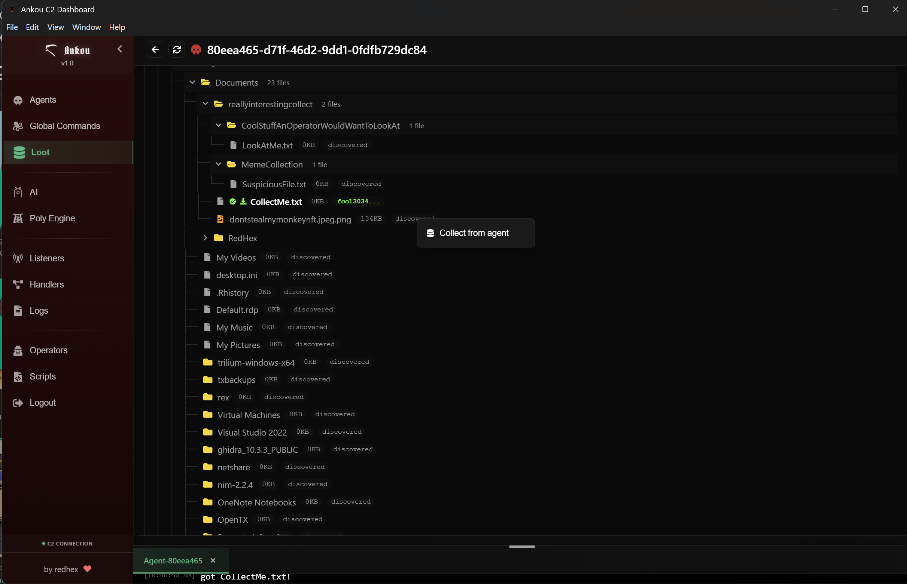

# 

# Ankou: Next-Generation Command & Control Framework

Ankou is a modern, modular command-and-control (C2) platform designed to let operators move fast without sacrificing tradecraft. Every component—from the transport relay to the desktop client—ships with sensible defaults so you can clone the repository, run the provided commands, and start experimenting immediately. The built-in AI companion lowers the learning curve for new operators while giving seasoned teams a force multiplier for deep target analysis.

## Why Operators Choose Ankou

- **Streamlined modular architecture** – Clean separation between server, ghost relay, agents, and UI. Swap transports, add handlers, or drop in new agents without touching unrelated code.
- **Human-in-the-loop AI companion** – A built-in assistant that ties into your self-hosted OpenWebUI instance, helping triage targets, surface fresh opportunities, and keep sensitive data on infrastructure you control. It guides newer operators with suggested commands and checklists while enabling veterans to interrogate environments faster.
- **AI-assisted binary diversification** – Automated variant generation pipelines make it harder for defenders to signature your binaries and let you iterate per campaign.
- **Operator-first UX** – Navigate live file systems, loot collections, and agent timelines in an Electron client that stays in sync via GraphQL subscriptions and WebSockets.
- **Automation playbooks** – Store repeatable workflows in the Automations tab so teams can replay proven sequences, reduce handoff friction, and keep recurring activities consistent across operators.

---

## Core Architecture at a Glance

| Component | Description |
|-----------|-------------|
| **Server (`server/`)** | Go-based API + WebSocket hub with GraphQL schema, persistent tasking, loot storage, JWT auth, and HMAC-protected agent endpoints. Generates TLS certificates, secrets, and SQLite databases on first run (`go run .`). |
| **Ghost Relay (`ghost-relay/`)** | Disposable front-end that speaks multiple transports (HTTPS, HTTP/3 QUIC, SSH, SMB/WebSocket) and replays traffic to the server. Every protocol lives in an `accept_*.go` module, so adding a new transport is as simple as copying a template. |
| **Agents (`agents/<name>/`)** | Reference implants (geist, phantasm, shade) that demonstrate different transport stacks and command sets. Each agent handles HMAC signing, task execution, and loot return. |
| **Client (`frontend/`)** | Electron/Vite desktop app with live dashboards, listener management, filesystem explorers, AI assistant panel, and loot views. Run `npm install && npm run electron` to launch. |

Mapped together they form a layered C2 architecture that keeps the real server hidden while letting you extend transports or agent behaviors independently.

---

## Feature Spotlight

### 1. Modular Transports & Handlers
- Ghost Relay binds transports to agent families (e.g., QUIC → geist) and injects the minimal metadata (`X-Agent-Type`, HMAC headers) the server needs.
- Add new handlers through JSON config (`server/agent_handlers/handler_*.json`). The UI instantly surfaces supported commands, and the server translates operator input to agent-native opcodes.
- Custom transport in mind? Follow the [ghost-relay new transport guide](docs/ghost-relay-new-transport.md) and you’ll have a production-ready module in minutes.

### 2. Human-in-the-Loop AI Companion
- The client’s **AI Operations** panel communicates with your OpenWebUI instance so all target data stays on hosts you control.
- Plug in your favorite local or self-hosted LLM; the assistant ingests the full history of command output, builds a shared understanding of the target, and can summarize results, flag anomalies, draft follow-on commands, or watch for notable artifacts while you remain in full control.
- Guided workflows help less experienced operators learn the rhythm of an engagement: the assistant explains context, proposes vetted commands, suggests decision trees, and highlights common next moves. Veteran operators can focus on higher-level strategy, using AI to sift noisy telemetry, compare hosts, or spot pivot points in seconds.
- Click-to-run recommendations (using `<cmdankou>` tags) let you execute AI-suggested commands straight from the chat, keeping operations quick yet auditable.
- The Poly Engine view lets you feed raw loot or binaries through the same OpenWebUI backend for automated triage, detonation scripting, or rapid reverse-engineering notes.
- Because everything is proxied through OpenWebUI, you can experiment with different models without touching Ankou’s core code—great for testing new LLMs, keeping models aligned with mission policy, or swapping to air-gapped models mid-operation.


### 3. AI-Assisted Binary Diversification
- Ankou’s agent build system includes hooks for polymorphic compilation, allowing you to produce campaign-specific binaries with randomized traits.
- Diversification logic integrates with command mappings so operators don’t need to learn per-variant quirks—tasking stays consistent while binaries look unique on disk.


### 4. Operator Workflow Enhancements
- **File system & loot explorers** – Browse remote directories, queue downloads/uploads, and tag loot from a single pane. Loot entries replicate across the team instantly.
- **Listener orchestration** – Start/stop HTTPS listeners from the UI, with relay coordination handled transparently.
- **GraphQL + WebSocket pipeline** – All state changes broadcast live to connected clients, ensuring operators never miss a heartbeat, command result, or loot update.




### 5. Automation Playbooks
- The **Automations** tab captures repeatable playbooks—quick triage, privilege escalation, lateral movement—so teams can trigger a curated workflow instead of rebuilding checklists every engagement.
- Operators reclaim time by replaying vetted sequences with a click, while the AI assistant can adapt playbooks mid-run when intel changes.


---

## Quickstart (Everything “Just Works”)

- Install the latest version of golang
- Run quickstart.py
- Note your registration key and the agent HMAC key (you can find them again later easily)
- Run or build ghostrelay

```sh
cd ghost-relay
go run .
# or
go build .
```

- run or build the C2

```sh
cd server
go run .
# or
go build .
```

- Jump into any agent directory and run the build script, fill out the requested feilds in accordance with your relay and C2 setup.


> **Need more detail?** Consult the full guides:
> - [Architecture Overview & Quickstart](docs/overview.md)
> - [Adding a New Agent, Handler, and Listener](docs/adding-new-agent.md)
> - [Ghost Relay: Adding a New Transport](docs/ghost-relay-new-transport.md)

---

## Building Standalone Desktop Applications (if you perfer building your own release instead of using ours)

The Ankou client can be packaged as standalone desktop applications for Windows, Linux, and macOS:

```sh
cd frontend

# Build for Windows (NSIS installer + portable .exe)
npm run dist:win

# Build for Linux (AppImage + .deb package)
npm run dist:linux

# Build for macOS (DMG for Intel and Apple Silicon)
npm run dist:mac

# Build for all platforms
npm run dist:all
```

You can also simply run the application with npm instead if you'd rather not build it:
```sh
npm build

npm run electron
```

**Outputs** are placed in `frontend/release/`:
- **Windows:** `Ankou C2-0.1.0-x64.exe` (installer) and portable version
- **Linux:** `Ankou C2-0.1.0-x64.AppImage` and `.deb` package
- **macOS:** `Ankou C2-0.1.0-x64.dmg` (Intel) and `Ankou C2-0.1.0-arm64.dmg` (Apple Silicon)

See [frontend/BUILD.md](frontend/BUILD.md) for detailed build instructions, troubleshooting, and configuration options.

---

## Repository Layout

```
├── agents/               # Reference implants (geist, phantasm, shade, wraith)
├── docs/                 # Architectural docs, diagrams, transport recipes
├── frontend/             # Electron + React/Vite operator console
├── ghost-relay/          # Pluggable transport proxy
└── server/               # Go API, GraphQL schema, persistence, WebSockets
```

Data you retreive resides here:
- `server/agents.db` – SQLite database generated on first boot.

---

## Roadmap & Contributions

We’re actively iterating on:
- **Geist, Shade and Phantasm** to make them more feature complete and easier to extend.
- **Better agentic excution** to make your life easier.
- **More C2 protocol support out of the box** so you can use more of our stuff as templates to make awesome tools.

### Want something specific?
Open a GitHub issue with feature suggestions or rough concepts—we prioritize ideas the community needs. Pull requests are welcome too; check the docs linked above for guidance before you dive in.

---

## FAQ

**Q: My agent registration request returns HTTP 502. What did I miss?**  
A: The listener is paused. Open the desktop client, go to **Listeners**, find the listener the agent should use, and click **Resume**. Once the listener shows as running, registration will succeed.

**Q: How can I leave feedback or suggest features?**  
A: Create a GitHub issue. Be as detailed as possible—screenshots, logs, or workflow descriptions help us prioritize and respond quickly.

**Q: Why is each agent one monolithic file?**
A: We got the best results with Polyengine by delivering a single file to the LLM, we know it can make understanding the codebase harder, but we wanted to push the limits of what AI could do for us.

---

## Ethical Use

**Usage of this tool**

Ankou is strictly intended for **ethical research, security testing, and defense purposes** only. We **do not condone or support any malicious activity**, unauthorized access, or actions violating laws or the rights of others.

By using this software, you agree to comply with all applicable laws and regulations in your jurisdiction. The code is provided **as-is**, without warranty of any kind. Use at your own risk.

---

## Contact RedHex

- Website: [redhex.net](https://redhex.net)
- Email: [capabilities@redhex.net](mailto:capabilities@redhex.net)

---

**Stay stealthy, stay modular.** Ankou keeps your operations agile while letting you experiment with the latest tradecraft, AI workflows, and transport mechanisms—all without leaving your own infrastructure.

