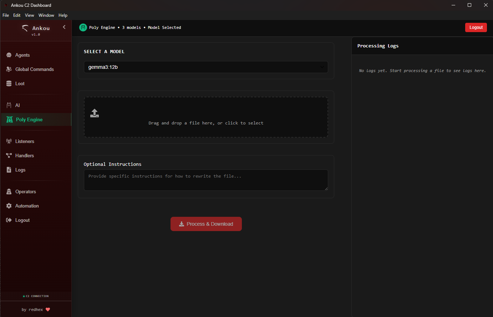

# 

### Join our Discord for discussions, support, suggestions, and development input
[](https://discord.gg/dkVC3NKsqp)

# Ankou: Next-Generation Command & Control Framework

Ankou is a modern, modular command-and-control (C2) platform designed to let operators move fast without sacrificing tradecraft. Every component—from the transport relay to the desktop client—ships with a quickstart script so you can clone the repository, set your implant keys, run the provided commands, and start experimenting immediately. The built-in AI companion lowers the learning curve for new operators while giving seasoned teams a force multiplier for deep target analysis. Ankou includes three default agents ready for your team to cutomize - you can also create entirely new handlers for a new, fresh, never before seen agent just for your team.


---

## Core Architecture at a Glance

| Component | Description |
|-----------|-------------|
| **Server (`server/`)** | Go-based API + WebSocket hub with GraphQL schema, persistent tasking, loot storage, JWT auth, and HMAC-protected agent endpoints. Generates TLS certificates, secrets, and SQLite databases on first run (`go run .`). |
| **Ghost Relay (`ghost-relay/`)** | Disposable front-end that speaks multiple transports (HTTPS, HTTP/3 QUIC, SSH, SMB/WebSocket) and replays traffic to the server. Every protocol lives in an `accept_*.go` module, so adding a new transport is as simple as copying a template. |
| **Agents (`agents/<name>/`)** | Reference implants (geist, phantasm, shade) that demonstrate different transport stacks and command sets. Each agent handles HMAC signing, task execution, and loot return. |
| **Client (`frontend/`)** | Electron/Vite desktop app with live dashboards, listener management, filesystem explorers, AI assistant panel, and loot views. Run `npm install && npm run electron` to launch. |

Mapped together they form a layered C2 architecture that keeps the real server hidden while letting you extend transports or agent behaviors independently.

---

## Feature Spotlight

### 1. Modular Transports, Handlers & Custom Agents
- **Body-based agent identification** - Agents declare their type in request payloads, allowing unlimited agent types to share any transport without port coupling.
- Ghost Relay forwards traffic transparently, with agent types routed by the server based on body content rather than port bindings.
- Add new handlers through JSON config (`server/agent_handlers/handler_*.json`). The UI instantly surfaces supported commands for operators to use.
- Custom transport in mind? Follow the [ghost-relay new transport guide](docs/ghost-relay-new-transport.md) and you'll have a production-ready module in minutes.
- All these features provide an easy way to build a custom agent under it all; once your transport is set, take a look at the current agents and build one around your new handler with whatever TTPs you love to use.
- See [Body-Based Agent Identification](docs/body-based-agent-identification.md) for details on the flexible agent type system.

### 2. Human-in-the-Loop AI Companion
- The client's **AI Operations** panel talks to any OpenAI-compatible endpoint so all target data can stay on hosts you control (OpenAI, LM Studio, Ollama, OpenWebUI, etc.).
- Plug in your favorite local or self-hosted LLM; the assistant ingests the full history of command output, builds a shared understanding of the target, and can summarize results, flag anomalies, draft follow-on commands, or watch for notable artifacts while you remain in full control.
- Guided workflows help less experienced operators learn the rhythm of an engagement: the assistant explains context, proposes vetted commands, suggests decision trees, and highlights common next moves. Veteran operators can focus on higher-level strategy, using AI to sift noisy telemetry, compare hosts, or spot pivot points in seconds.
- Click-to-run recommendations (using `<cmdankou>` tags) let you execute AI-suggested commands straight from the chat, keeping operations quick yet auditable.
- Because everything is proxied through an OpenAI-compatible layer, you can swap models without touching Ankou's code.


### 3. AI-Assisted Binary Diversification
- Ankou’s Poly Engine rewrites your implant’s source structure while preserving full functionality. Each build will compile into a meaningfully different binary to reduce signaturability across campaigns.
- Diversification logic integrates with command mappings so operators don't need to learn per-variant quirks.



### 4. Operator Workflow Enhancements
- **File system & loot explorers** – Browse remote directories, queue downloads/uploads, and tag loot from a single pane. Loot entries replicate across the team instantly.
- **Listener orchestration** – Start/stop HTTPS listeners from the UI, with relay coordination handled transparently.
- **GraphQL + WebSocket pipeline** – All state changes broadcast live to connected clients, ensuring operators never miss a heartbeat, command result, or loot update.


### 5. Automation Playbooks
- The **Automations** tab captures repeatable playbooks—quick triage, privilege escalation, lateral movement—so teams can trigger a curated workflow instead of rebuilding checklists every engagement.
- Operators reclaim time by replaying vetted sequences with a click, while the AI assistant can adapt playbooks mid-run when intel changes.

## Agents at a glance

| Agent      | Platform       | Language           | Protocol / Transport        |
|------------|-------------------|--------------------|-----------------------------|
| **geist**  | Windows    | Rust               | HTTP3/QUIC                  |
| **phantasm** | Windows  | Go                 | HTTPS                       |
| **anomaly**  | Windows           | Node.js (inject in C) | HTTPS   |
| **shade**  | Linux           | Go | SSH   |
| **wraith** | Linux | Rust         | HTTP3/QUIC             |

> See [Agent Catalog](docs/agents.md) for details on each agent's design, protocol, and tasking model.

---

## AI Backend Configuration (OpenAI-Compatible)

The AI assistant and Poly Engine both speak the OpenAI API. You can point Ankou at any OpenAI-compatible backend:

- Local/self-hosted: LM Studio, Ollama, OpenWebUI (typically no API key by default)

Defaults and usage:
- **API Base URL**: Defaults to `http://localhost:11434/v1` (works out of the box for Ollama/LM Studio).
- **API Key**: Optional; only needed for providers that require auth (e.g., OpenAI). Leave blank for local backends that don’t require keys.
- Both the AI chat panel and Poly Engine share these settings, so you configure once and reuse.

---

## Quickstart (Everything "Just Works")

- Install the latest version of golang
- Run quickstart.py
- Note your registration key and the agent HMAC key (both are printed in green by quickstart.py; you can also find the agent HMAC key in `ghost-relay/relay.config` as `AGENT_HMAC_KEY` - you will need it to build an agent)
- Run or build ghostrelay

```sh
cd ghost-relay
go mod tidy
go run .
# or
go build .
```

- run or build the C2

```sh
cd server
go mod tidy
go run .
# or
go build .
```

- Jump into any agent directory and run the build script, fill out the requested fields in accordance with your relay and C2 setup.


> **Need more detail?** Consult the full guides:
> - [Architecture Overview & Quickstart](docs/overview.md)
> - [Adding a New Agent, Handler, and Listener](docs/adding-new-agent.md)
> - [Ghost Relay: Adding a New Transport](docs/ghost-relay-new-transport.md)

---

## Building Standalone Desktop Applications (if you perfer building your own release instead of using ours)

The Ankou client can be packaged as standalone desktop applications for Windows, Linux, and macOS:

```sh
cd frontend

# Build for Windows (NSIS installer + portable .exe)
npm run dist:win

# Build for Linux (AppImage + .deb package)
npm run dist:linux

# Build for macOS (DMG for Intel and Apple Silicon)
npm run dist:mac

# Build for all platforms
npm run dist:all
```

You can also simply run the application with npm instead if you'd rather not build it:
```sh
npm build

npm run electron
```

**Outputs** are placed in `frontend/release/`:
- **Windows:** `Ankou C2-0.1.0-x64.exe` (installer) and portable version
- **Linux:** `Ankou C2-0.1.0-x64.AppImage` and `.deb` package
- **macOS:** `Ankou C2-0.1.0-x64.dmg` (Intel) and `Ankou C2-0.1.0-arm64.dmg` (Apple Silicon)

See [frontend/BUILD.md](frontend/BUILD.md) for detailed build instructions, troubleshooting, and configuration options.

---

## Roadmap & Contributions

We're actively iterating on:
- **Rust agent integration for Geist and Phantasm** to make them smaller and deadlier right out of the box
- **Golang base templates for Geist, Shade and Phantasm** to make them more feature complete and easier to extend.
- **Better agentic excution** to make your life easier.
- **More C2 protocol support out of the box** so you can use more of our stuff as templates to make awesome tools.

### Want something specific?
Open a GitHub issue with feature suggestions or rough concepts—we prioritize ideas the community needs. Pull requests are welcome too; check the docs linked above for guidance before you dive in.

---

## FAQ

**Q: My agent registration request returns HTTP 502. What did I miss?**  
A: The listener is paused. Open the desktop client, go to **Listeners**, find the listener the agent should use, and click **Resume**. Once the listener shows as running, registration will succeed. If this is not the case you may have built your agent without a leading slash in front of the endpoint.

**Q: How can I leave feedback or suggest features?**  
A: Create a GitHub issue. Be as detailed as possible—screenshots, logs, or workflow descriptions help us prioritize and respond quickly.

**Q: Why is each agent one monolithic file?**
A: We got the best results with Polyengine by delivering a single file to the LLM, we know it can make understanding the codebase harder, but we wanted to push the limits of what AI could do for us.

---

## Ethical Use

**Usage of this tool**

Ankou is strictly intended for **ethical research, security testing, and defense purposes** only. We **do not condone or support any malicious activity**, unauthorized access, or actions violating laws or the rights of others.

By using this software, you agree to comply with all applicable laws and regulations in your jurisdiction. The code is provided **as-is**, without warranty of any kind. Use at your own risk.

---

## Contact RedHex

- Website: [redhex.net](https://redhex.net)
- Email: [capabilities@redhex.net](mailto:capabilities@redhex.net)

---

**Stay stealthy, stay modular.** Ankou keeps your operations agile while letting you experiment with the latest tradecraft, AI workflows, and transport mechanisms—all without leaving your own infrastructure.
