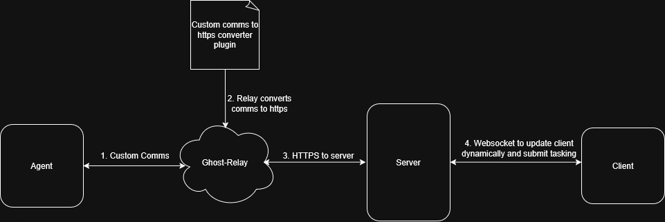

# Ankou Architecture Overview

This document explains how the major pieces of the Ankou platform interact and
shows where the provided architecture diagram fits within the overall system.

## Architecture Diagram



## Core Components

1. **Agent**  
   The agent is deployed onto the target computer. It communicates with the server via the Ghost-Relay in order to send tasking results and gather tasking requests.

2. **Ghost Relay**  
  The Ghost-Relay is a server that sits between the agent and the server. There are two primary advantages to this component. First, it obscures the location of the Server that contains collect and tasking. Second, it provides an interface for agents to communicate with the server via any communications protocol. The Ghost-Relay was designed with the intent to add new communications plugins extremely easily—see [Adding a New Transport](ghost-relay-new-transport.md) for a fast recipe.

3. **Server**  
   The server is responsible for the storage and management of all data related to collection and tasking. It authenticates operators, schedules work for agents, and tracks operational state. The server also emits real-time notifications so everyone connected sees status changes the moment they happen.

4. **Client**  
   Operator dashboard delivered as a desktop app that keeps a live WebSocket session with the server. It provides a unified view of agents, tasks, and collection, enabling quick decision-making and rapid follow-up actions.

Together, these four elements create a responsive C2 workflow while keeping sensitive infrastructure layered and resilient.

## Quickstart

1. **Install golang** (latest version)

2. **Run `quickstart.py`** from the repository root:
   ```sh
   python3 quickstart.py
   ```
   This generates all configuration files:
   - `server/ankou.config` - Server secrets (JWT_SECRET, HMAC_KEY, REGISTRATION_KEY)
   - `server/server_config.json` - Network bindings for operator and relay endpoints
   - `ghost-relay/relay.config` - Relay configuration with matching HMAC keys

3. **Save the registration key** displayed by `quickstart.py` - you'll need it for first login. It's also stored in `server/ankou.config` as `REGISTRATION_KEY` if you need to retrieve it later.

4. **Start the ghost relay** (reads configuration from `ghost-relay/relay.config`):
   ```sh
   cd ghost-relay
   go run .
   # or
   go build .
   ```

5. **Start the C2 server** (reads configuration from `server/ankou.config` and `server/server_config.json`):
   ```sh
   cd server
   go run .
   # or
   go build .
   ```
   What happens automatically:
   - Binds to the operator interface specified in `server/server_config.json` (defaults to `0.0.0.0:8443` over HTTPS)
   - Creates self-signed TLS material (`server.crt`, `server.key`) if they do not exist
   - Initializes the SQLite database (`agents.db`) and required tables

6. **Access the operator interface**:
   - Open your browser to the operator URL shown by `quickstart.py` (default: `https://localhost:8443`)
   - Accept the self-signed certificate warning
   - Click **Register** and enter the registration key from step 3
   - Choose a username/password

7. **Create a listener** (still in the client):
   - Open the **Listeners** view
   - Click **Add Listener** and configure:
     - Endpoint: Choose any endpoint path (e.g., `/api` or `/agent`)
   - Save, then click **Start** to bring it online
   - This listener exposes the endpoint for agent traffic coming from the relay

8. **Update relay configuration** (if needed):
   - The `UPSTREAM_URL` in `ghost-relay/relay.config` should be the base C2 server URL (e.g., `https://127.0.0.1:8444`) without the listener endpoint. The relay automatically appends the listener endpoint path when forwarding requests.
   - If your setup differs from the default, update `UPSTREAM_URL` accordingly and restart the relay to pick up changes

9. **Build and deploy agents**:
   - Jump into any agent directory (e.g., `cd agents/phantasm`)
   - Run the build script
   - The build script will prompt for configuration values:
     - Relay host/port (from `relay.config` or `quickstart.py` output)
     - HMAC key (from `relay.config` AGENT_HMAC_KEY)
     - Listener endpoint (the endpoint path you configured in step 7)

> **Need more detail?** Consult the full guides:
> - [Configuration Notes](configuration.md)
> - [Adding a New Agent, Handler, and Listener](adding-new-agent.md)
> - [Ghost Relay: Adding a New Transport](ghost-relay-new-transport.md)
> - [Agent Catalog](agents.md)
